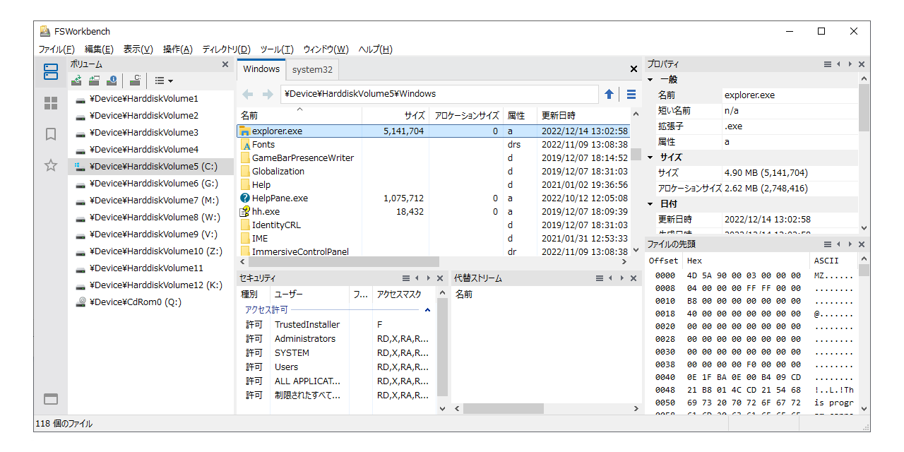

# FSWorkbench
### Version 4.0 (4.0.756.0)

FSWorkbenchは、コンピュータのハードディスクなどローカルストレージに含まれるファイルやディレクトリをGUIで表示・操作をするアプリケーションです。
ファイルシステムの情報を表示する他、コピー,移動,削除など基本的な操作も行えます。
ドライブの割り当てられていないボリュームを参照することも出来ます。

Version 4.0では、メインウィンドウのファイルリストを旧来のMDIスタイルからタブで切り替えるウィンドウに変更しました。
ATLとWTLを使用した伝統的なWin32アプリケーションで、WinUIの様な最新のスキーム、デザインには対応していませんが、Windows 7、Windows 8.1やGUIが構成されたWindows RE/PEといった環境でも動作します。

- ファイルシステム関連の情報を表示する他、コピー,移動,削除など基本的な操作に加え、日付の変更なども行えます。

- ドライブの割り当てられていないボリュームを参照することも出来ます。

- MAX_PATH(260文字)以上のパスを扱えます。

- ユーザーインターフェイスはTAB形式で、複数のファイルリストを表示できます。

- ユーザーモードで使用できますが、管理者モードで実行した場合すべての機能が利用できます。例えばWIMイメージ管理ツールなどは管理者モードでのみ実行できます。

> **Note**   
>FSWorkbenchは現在のところオープンソースではありません。   
>FSWorkbench is not open source. You will find here the builds only. 

### 最新のバージョン(4.0.756.0)

- .lnkファイルをメニューの\[項目を開く\]>\[管理者として開く\]から開く場合、直接管理者として開ける様に変更。以前は\[開くアプリケーションを選択\]ダイアログが表示されていた。

- ファイルリストにヘッダ域とボリュームドロップダウンを追加。表示/非表示をリスト毎に選択可能。   
  メニューの \[表示\]>\[レイアウト\]>\[ファイルリストヘッダ\] で表示/非表示を選択。

- 画像ビューアを追加。   
  メニューの \[ツール\]>\[画像ビューア\] から開く。   
  （画像ビューアのウィンドウに画像をドロップして使用します。）

- その他、ソースコードの整理。

[これまでのバージョンの履歴](https://github.com/yamashita-software-works/FSWorkbench/blob/main/HISTORY.md)

### 実行環境

Windows 11,Windows 10,Windows 8.1,Windows 7   
(64bit版/32bit版(10,8.1,7),ARMプロセッサには非対応です)

### インストール

適切な場所にフォルダを作成し、書庫ファイルの内容を展開してください。 
空のフォルダに展開することを強くお勧めします。

### 実行方法
展開した場所から、fsworkbench.exeを実行してください。

### アンインストール

現在アンインストーラは用意されておりませんので、展開したファイルをユーザーご自身で削除してください。

現在はアンインストールしてもレジストリキーがそのままになります。気になる場合はご自身でキーを削除してください。
FSWorkbench自身が使用するレジストリキーは以下の通りです。
 (他にWindowsが他のレジストリパスに記録することがあります)

      HKEY_CURRENT_USER\Software\YamashitaSoftwareWorks\FSWorkbench

### 使用条件

本ソフトウェアは、下記条件を承諾の上であれば自由に無償で使用できます。

- 本ソフトウェアはご利用になる方の責任で使用してください。
  作者及び頒布者は本ソフトウェアの実行によって生じる結果に関して一切の責任を
  負いません。

- 本ソフトウェアを操作した結果データが失われたり、ソフトウェアが表示した内容，
  実行環境の差異，未知の不具合などが原因で損害が生じた場合でも、作者及び頒布者
  は一切の責任を負いません。

- 本ソフトウェアは自由に再頒布できますが、再頒布時は書庫ファイル内のファイル,
  ディレクトリ構成はそのままで変更しないでください。

- ソフトウェアの性質上、コンピュータ上のファイルの削除や属性の変更、コピーに
  よる内容の上書きなど、ファイルに対して不可逆な操作も行えますので十分注意し
  て使用してください。

- 不具合等の連絡は、下記メールアドレスなどよりお願いします。

- 本ソフトウェアの著作権は作者が留保します。

  Copyright (C) 2015-2023 山下 克宏 (YAMASHITA Katsuhiro), Yamashita Software Works. All right reserved.

***
FSWorkbench is a tool that displays information for files and directories on a local volume and performs simple operations. These operations are also available for volumes that do not have a drive assigned.
Not a "Filer" for comfortable user experience.

NOTICE:   
- This is a BETA version.
- Currentary, FSWorkbench is not open source. You will find here release builds only.
